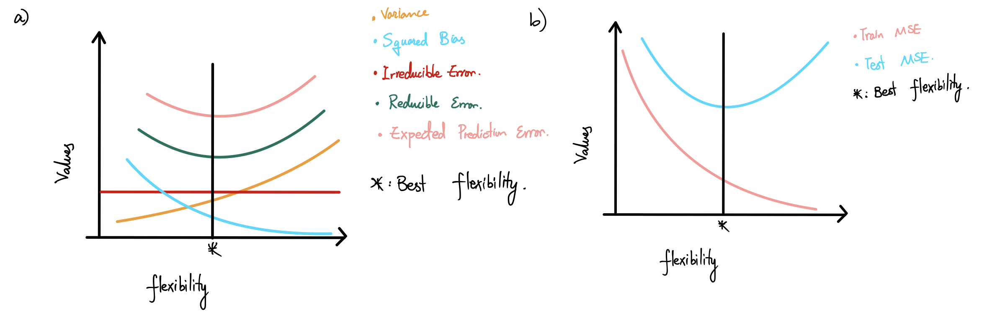

```{r setup, include=FALSE}
knitr::opts_chunk$set(echo = TRUE)
library(tidyverse)
library(sqldf)
```

## 1.

### a) 

Taking a parametric approach will have following pros:  
 - Does not need a lot of data  
 - Simplifies the problem because it is generally much easier to estimate a set of parameters  
and cons:  
 - The model we choose will usually not match the true unknown form of $f$, and if
 the chosen model is too far from the true $f$, then our estimate will be poor.  
Taking a nonparametric approach will have following pros:  
 - Avoid unnecessary assumptions about the functional form of $f$ will have the
 potential to accurately fit a wider range of possible shapes for $f$.  
 and cons:  
 - A very large number of observations is required in order to obtain an accurate
 estimate for $f$.  
 
### b)

For parametric approach, I would say when we have a small number of observations
to work with, such as getting survey on people's blood pressure and hours of physical 
exercises they do each week. And we know that having more time to exercises will result in a lower blood pressure
as a matter of fact. Hence we can make assumptions to $f$ in this case to be a 
linear model:
\[blood\;pressure \approx \beta_0 + \beta_1 \times physical\;exercises\]

### c)

For non-parametric approach, I would say when we have a lot of data to work with,
we can use this method to do the same prediction as part b). 


## 2.

### a) 

In this case, I would expect the inflexible methods to perform better. Since sample
size is small, there won't be enough data for flexible methods such as deep learning
and etc. Also, the number of predictors are large, hence it would be a good practice
to use OLS so that we have more interpretability. Hence inflexible methods tends to perform better.

### b)

In this case, I would expect the flexible method to perform better. Because we have a larger sample, a flexible method can take advantage of that and get more information out of it. The large n also greatly reduces the risk of over-fitting with flexible method.


### c)

Inflexible methods have a lot of trouble picking up non-linear relationships, so we should prefer a flexible method.

### d)

In this case, I would expect inflexible method to perform better. Higher variance will tend to introduce noise. The high variance of error terms means that the sample will have a lot of noise in the relationship. Therefore we should prefer an inflexible method that is less likely to put more weight on the noise hence gave us more accurate result.

## 3.

### a)
 It is a regression problem. And the goal is prediction, where $n = 50, p = 8$.
 
### b)
 It is a classification problem. And the goal is inference, where $n = 50, p = 6$.
 
## 4.

### a) and b)



### c)

$\hat f$ that has a smallest Bias and extremely high Variance would be when the 
true $f$ is linear, but $\hat f$ is derived with a very flexible approach, which will result in over-fitting, and $\hat f$ put too much weight on the irreducible error hence introduce high Variance despite having smallest Bias.

### d)

One of the example of $\hat f$ in this case would be a linear fit(least squares). And the true $f$ is not so linear, hence it will introduce high bias since we assume the data is a linear fit. And It tends to have low Variance since the result from a linear fit is consistent.

## 5.

### a)

```{r ex5a}
n <- 25

red <- data.frame(X1 = rnorm(n, 0, 1), X2 = rnorm(n, 0, 1)) %>%
  mutate(color = "red")
blue <- data.frame(X1 = rnorm(n, 1.5, 1), X2 = rnorm(n, 1.5, 1)) %>%
  mutate(color = "blue")

trainset <- rbind(red, blue)

plot(trainset$X1, trainset$X2,
     col = trainset$color,  xlab = "X1", ylab = "X2", pch = 16)
legend("topleft",
       c("red", "blue"),
       col = c("red", "blue"),
       pch = 16
       )
```
### b.

```{r ex5b}
# Generating test set
test_red <- data.frame(X1 = rnorm(n, 0, 1), X2 = rnorm(n, 0, 1)) %>%
  mutate(color = "red")
test_blue <- data.frame(X1 = rnorm(n, 1.5, 1), X2 = rnorm(n, 1.5, 1)) %>%
  mutate(color = "blue")

testset <- rbind(test_red, test_blue)

plot(testset$X1, testset$X2, col = testset$color, pch = 16, xlab = "X1", ylab = "X2")
points(trainset$X1, trainset$X2, col = trainset$color, pch = 17)
legend("topleft",
       c("train_blue", "train_red", "test_blue", "test_red"),
       col = c("blue", "red", "blue", "red"),
       pch = c(17,17,16,16)
       )

```

### c)

```{r}
library(class)
train <- trainset[,1:2]
test <- testset[,1:2]

train_error <- rep(0, 20)
test_error <- rep(0, 20)
k <- c(1:20)


cl <- factor(c(rep("red", 25),rep("blue", 25)))
smallest_test_error <- data.frame(1, NA)
for (i in k) {
  predictions_train <- knn(train, train, cl, k = i, prob = FALSE)
  train_error[i] <- mean(predictions_train != cl)
  predictions_test <- knn(train, test, cl, k = i, prob = FALSE)
  test_error[i] <- mean(predictions_test != cl)
  if(test_error[i] < smallest_test_error[1]){
    smallest_test_error[1] = test_error[i]
    smallest_test_error[2] = i
  } 
}
plot(1/k , train_error, col='red', type = 'b', ylim = c(0, 0.4), ylab = "error rate", xlab = "1/K")
points(1/k, test_error, col='blue', type = 'b')
legend("topright",
       col = c("red", "blue"),
       c("Train Error", "Test Error"),
       pch = c(1,1))
```
As $k$ decreases, $1/k$ increases, which means the level of flexibility increases. And our result shows that training error can be reduced to zero, however, our test error tends to wobble and create a "U-Shape". Hence, it's critical to choose a proper number of neighbors $k$.

### d)

```{r ex5d}
plot(testset$X1, testset$X2, col = testset$color, pch = 20, xlab = "X1", ylab = "X2")
points(testset$X1, testset$X2, col = paste0("",knn(train, test, cl, k = smallest_test_error[2], prob = FALSE),""), pch = 1)
legend("topright",
       c("red test", "blue test", "red predict", "blue predict"),
       col = c("red", "blue", "red", "blue"),
       pch = c(20,20,1,1))
```
### e).

The formula gives us the intuition on how to calculate the Bayes Error Rate
$$
1 - E[\max_j P(Y = j | X)] = 
$$
In this case, the Bayes Error Rate would be, and it relates to part c) and d) where the Test Error is always going to be greater than the Bayes Error Rate. Hence it is just like the irreducible error term, where it is the best we can do when fitting data.


## 6.

### a)

```{r ex6a}
n <- 200

determine_color <- function(X1, X2){
  f = (X1 - 0.5)^2 + (X2 - 0.5)^2
  ifelse(f > 0.15, ifelse(X1 > 0.5, "red", "green"), "blue")
}

trainset <- tibble(X1 = runif(n,0,1),
                   X2 = runif(n,0,1),
                   color = determine_color(X1, X2))

plot(trainset$X1, trainset$X2,
     col = trainset$color,  xlab = "X1", ylab = "X2", pch = 16)
legend("topleft",
       c("red", "green", "blue"),
       col = c("red","green", "blue"),
       pch = 16
       )
```

### b).

```{r}
testset <- tibble(X1 = runif(n,0,1),
                   X2 = runif(n,0,1),
                   color = determine_color(X1, X2))

plot(testset$X1, testset$X2, col = testset$color, pch = 16, xlab = "X1", ylab = "X2")
points(trainset$X1, trainset$X2, col = trainset$color, pch = 17)
legend("topleft",
       c("train_red","train_green","train_blue","test_red", "test_green", "test_blue"),
       col = c("red", "green", "blue", "red","green","blue"),
       pch = c(17,17,17,16,16,16)
       )

```

### c).

```{r}
library(class)
train <- trainset[,1:2]
test <- testset[,1:2]

train_error <- rep(0, 50)
test_error <- rep(0, 50)
k <- c(1:50)


smallest_test_error <- data.frame(1, NA)
for (i in k) {
  predictions_train <- knn(train, train, cl = trainset$color, k = i, prob = FALSE)
  train_error[i] <- mean(predictions_train != trainset$color)
  predictions_test <- knn(train, test, cl = trainset$color, k = i, prob = FALSE)
  test_error[i] <- mean(predictions_test != testset$color)
  if(test_error[i] < smallest_test_error[1]){
    smallest_test_error[1] = test_error[i]
    smallest_test_error[2] = i
  } 
}

plot(1/k , train_error, col='red', type = 'b', ylim = c(0, 0.4), ylab = "error rate", xlab = "1/K")
points(1/k, test_error, col='blue', type = 'b')
legend("topright",
       col = c("red", "blue"),
       c("Train Error", "Test Error"),
       pch = c(1,1))
```

### d).
```{r}
plot(testset$X1, testset$X2, col = testset$color, pch = 20, xlab = "X1", ylab = "X2")
points(testset$X1, testset$X2, col = paste0("",knn(train, test, trainset$color, k = smallest_test_error[2], prob = FALSE),""), pch = 1)
legend("topleft",
       c("red test", "green test", "blue test", "red predict", "green predict", "blue predict"),
       col = c("red","green", "blue", "red","green", "blue"),
       pch = c(20,20,20,1,1,1)
       )
```
### e).
In this case, the Bayes Error Rate would be, and it relates to part c) and d) where the Test Error is always going to be greater than the Bayes Error Rate. Hence it is just like the irreducible error term, where it is the best we can do when fitting data.

## 7.


```{r ex7_import_data, warning=FALSE}
library(ISLR2)
```

### a)
```{r ex7a}
data <- Boston
head(data)

# Get number of rows
row_number <- nrow(data)

# Get number of columns
col_number <- ncol(data)

```
And there are `r col_number` columns, and `r row_number` rows.
Number of rows represent the number of observations in our dataset. And number of 
columns represent the number of features/predictors each observations have we have.

### b)
```{r}
par(mfrow =c(2,2))
plot(data$age, data$crim) # check and see if crime rate is related to age of the units build prior to 1940
plot(data$age, data$rm) # check if number of rooms is related to age of the units build prior to 1940
plot(data$ptratio, data$medv) # check if the number of students per teacher has an effect on median value of homes
plot(data$dis, data$medv) # check if the distance to employment centers has an effect on median value of homes
```
My findings are:

  - newily built units tends to have lower per captia crime rate by town
  - newily build units tend to have more rooms compare to old units
  - the higher student per teacher ratio, the lower their median house prices tend to bee
  - People lives close to the business center of Boston tend to have lower median house prices
  
  
### c.

From my finding in part b. I believe that there's relationship between proportion
of owner-occupied units built prior to 1940 and per capita crime rate.

And the relationship is exponential, as the proportion of old houses grow, the 
number of per capita crime rate grows exponentially.


### d.

```{r}
range(data$crim)
range(data$tax)
range(data$ptratio)

par(mfrow = c(2,2))
hist(data$crim, freq = FALSE, breaks = 25)
hist(data$tax, freq = FALSE)
hist(data$ptratio, freq = FALSE)
```
As we can see from the above range and histograms of Per Capita Crime Rate, Tax rate and pupil-teacher ratio. We can see that the crime rate in Boston has a longer tail, hence,  despite lower crime rate in most towns, some town in Boston could have really high crime rate. And for tax, there's a huge divide between suburbs. And for pupil-teacher ratio, it is skewed to the left, and peaked at 20-21.


### e.

```{r}
sum(data$chas)
```

35 suburbs in this data set bound the Charles river

### f.

```{r}
mean(data$ptratio)
sd(data$ptratio)
```
Mean of pupil-teacher ratio is 18.45553 and standard deviation of pupil-teacher ratio
is 2.164946.


### g.

```{r ex7g}
highest_medv <- sqldf("SELECT * FROM data
             WHERE medv =(SELECT MAX(medv) FROM data)")
highest_medv
```


```{r}
n <- row_number
par(mfrow = c(2,2))
plot(sort(data$crim),(1:n - 1)/(n - 1), type="l",
xlab = "Per capita crime rate by town",
ylab = "Quantile")
abline(v=mean(highest_medv$crim), col="blue")


plot(sort(data$zn), (1:n - 1)/(n - 1), type="l",
xlab = "proportion of residential land zoned for lots over 25,000 sq.ft",
ylab = "Quantile")
abline(v=mean(highest_medv$zn), col="blue")


plot(sort(data$indus), (1:n - 1)/(n - 1), type="l",
xlab = "proportion of non-retail business acres per town",
ylab = "Quantile")
abline(v=mean(highest_medv$indus), col="blue")


plot(sort(data$chas), (1:n - 1)/(n - 1), type="l",
xlab = "Charles River dummy variable",
ylab =  "Quantile")
abline(v=mean(highest_medv$chas), col="blue")


par(mfrow = c(2,2))

plot(sort(data$nox),(1:n - 1)/(n - 1), type="l",
xlab = "nitrogen oxides concentration",
ylab = "Quantile")
abline(v=mean(highest_medv$nox), col="blue")


plot(sort(data$rm), (1:n - 1)/(n - 1), type="l",
xlab = "average number of rooms per dwelling",
ylab = "Quantile")
abline(v=mean(highest_medv$rm), col="blue")


plot(sort(data$age), (1:n - 1)/(n - 1), type="l",
xlab = "proportion of owner-occupied units built prior to 1940",
ylab = "Quantile")
abline(v=mean(highest_medv$age), col="blue")


plot(sort(data$dis), (1:n - 1)/(n - 1), type="l",
xlab = "weighted mean of distances to five Boston employment centres",
ylab =  "Quantile")
abline(v=mean(highest_medv$dis), col="blue")

par(mfrow = c(2,2))

plot(sort(data$rad), (1:n - 1)/(n - 1), type="l",
xlab = "index of accessibility to radial highways",
ylab = "Quantile")
abline(v=mean(highest_medv$rad), col="blue")


plot(sort(data$tax), (1:n - 1)/(n - 1), type="l",
xlab = "full-value property-tax rate per $10,000",
ylab =  "Quantile")
abline(v=mean(highest_medv$tax), col="blue")

plot(sort(data$ptratio), (1:n - 1)/(n - 1), type="l",
xlab = "pupil-teacher ratio by town",
ylab = "Quantile")
abline(v=mean(highest_medv$ptratio), col="blue")


plot(sort(data$lstat), (1:n - 1)/(n - 1), type="l",
xlab = "lower status of the population",
ylab =  "Quantile")
abline(v=mean(highest_medv$lstat), col="blue")
```

```{r}
summary(Boston)
```
As we can see from above quantile graphs, we can see that suburbs with highest median
value of owner-occupied homes(in blue line) tends to:

  - have low per capita crime rate by town
  - have smaller proportion of residential land 
  - at 50th percentile for proportion of non-retail business acres per town
  - at around 50th percentile for nitrogen oxides concentration
  - have more rooms
  - at around 50th percentile for proportion of owner-occupied units built prior to 1940
  - closer to five Boston employment centers
  - between median and 3rd quantile in terms of accessibility to radial highways
  - at around 50th percentile for full-value property-tax rate per $10,000.
  - have smaller pupil-teacher ratio by town
  - have smaller percent of lower status of the population
  
  
### h.

```{r}
sqldf("SELECT COUNT(*) AS more_than_six FROM Boston
      WHERE rm > 6")

sqldf("SELECT * FROM Boston
      WHERE rm > 8")
```

It tends to have lower crime rate.


