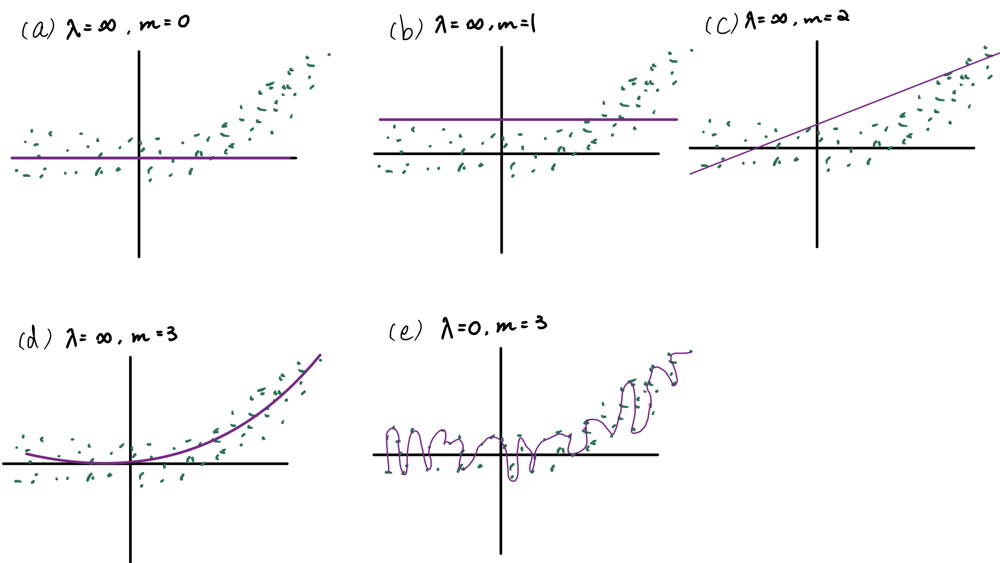

```{r setup, include=FALSE}
knitr::opts_chunk$set(echo = TRUE)
library(tidyverse)
library(ISLR2)
library(tidymodels)
library(splines)
library(tree)
library(repr)
library(boot)
library(randomForest)
options(repr.plot.width=12, repr.plot.height=6)
```

## 1
{#id .class width=90% height=80%}

For (a) to (d), when $\lambda = \infty$, we have a large penalty term that forces our function $g$ to be smooth.

__(a)__

When $\lambda=\infty, m = 0$, $g^{(0)}(x) \to 0$. So, $\hat{g}=0$. 

__(b)__

When $\lambda=\infty, m = 1$, $g'= 0$. So, $\hat{g}=constant$, it would be a horizontal line.

__(c)__

When $\lambda=\infty, m = 2$, $g''= 0$.So, $\hat{g}$ would be a straight line with slope.
  
__(d)__

When $\lambda=\infty, m = 3$, $g'''= 0$. So, $\hat{g}$ woule be a curve that is quadratic. 

__(e)__
  
When $\lambda=0$ the penalty term has no effect in our function, so we get a curve/spline that interpolates all the n points perfectly.


## 2.

```{r}
curve(2 + 3*(ifelse(x >= 0,
                   ifelse(x <= 2, 1, 0), 0) - (x+1)*ifelse(x >= 1,
                   ifelse(x <= 2, 1, 0), 0)) - 2 * ((2*x-2) * I(x>=3 & x <=4) -I(x > 4 & x <= 5)) ,
      from = -2,
      to  = 6,
      xlab = "X",
      ylab = "Y",
      col = "lightblue",
      lwd = 2,
      main = "Plot of X vs Y")
```


## 3.

$$
\begin{aligned}
f(X) &= \beta_0 + \beta_1X + \beta_2X^2 + \beta_3X^3 + \beta_4(X - \psi)^3_+\\
\end{aligned}
$$

- We can first find a cubic polynomial for $X \leqslant \psi$

$$
\begin{aligned}
f_1(X) &= \beta_0 + \beta_1X + \beta_2X^2 + \beta_3X^3 + \beta_4(X - \psi)^3_+\\
&= \beta_0 + \beta_1X + \beta_2X^2 + \beta_3X^3
\end{aligned}
$$

- And we now have $f_1(X) = f(x)$. Then, for $X \geqslant \psi$.

$$
\begin{aligned}
f_2(X) &= \beta_0 + \beta_1X + \beta_2X^2 + \beta_3X^3 + \beta_4(X - \psi)^3\\
&= \beta_0 + \beta_1X + \beta_2X^2 + \beta_3X^3 +\beta_4(X^3 -3\psi X^2 + 3\psi^2 X - \psi^3)\\
&= (\beta_0 - \beta_4\psi^3) + (\beta_1 + 3\psi^2)X + (\beta_2 - 3\psi\beta_4)X^2 + (\beta_3 + \beta_4)X^3
\end{aligned}
$$

- We now have shown that $f_2(X) = f(X)$. Then, we just need to show that $f(X)$ is continuous at $\psi$. 

- At $X = \psi$:

$$
\begin{aligned}
f_1(\psi) &=\beta_0 + \beta_1\psi + \beta_2\psi^2 + \beta_3\psi^3\\
f_2(\psi) &= (\beta_0 - \beta_4\psi^3) + (\beta_1 + 3\psi^2)\psi + (\beta_2 - 3\psi\beta_4)\psi^2 + (\beta_3 + \beta_4)\psi^3\\
&= \beta_0 + \beta_1\psi + \beta_2\psi^2 + \beta_3\psi^3
\end{aligned}
$$

Hence, we have \[f_1(\psi) = f_2(\psi)\] Therefore $f(X)$ is continuous at $\psi$.

- We now want to show that $f'(\psi) = f'(\psi)$ so that we can show $f'(X)$ is continuous at $\psi$.

$$
\begin{aligned}
f'_1(\psi) &= \beta_1 + 2\beta_2\psi + 3\beta_3 \psi^2\\
f'_2(\psi) &= \beta_1 + 3\psi^2\beta_4 + 2(\beta_2 - 3\beta_4\psi)\psi + 3(\beta_3 + \beta_4)\psi^2\\
&=\beta_1 + 2\beta_2\psi + 3\beta_3 \psi^2
\end{aligned}
$$
Hence, we have \[f'_1(\psi) = f'_2(\psi)\] Therefore $f'(X)$ is continuous at $\psi$.

- We now want to show that $f''(\psi) = f''(\psi)$ so that we can show $f''(X)$ is continuous at $\psi$.

$$
\begin{aligned}
f''_1(\psi) &= 2\beta_2 + 6\beta_3 \psi\\
f''_2(\psi) &= {\partial \over \partial \psi} f'_2(\psi)\\
&= 2\beta_2 + 6\beta_3 \psi
\end{aligned}
$$

Hence, we have \[f''_1(\psi) = f''_2(\psi)\] Therefore $f''(X)$ is continuous at $\psi$. Therefore, $f(x)$ is indeed a cubic spline.

## 4.

- To begin with, I first split the data into Training set and Validation set

```{r ex4}
data(Wage)

set.seed(435)
# Train-Test Split
wage_split <- initial_split(Wage, strata = age)

wage_train <- training(wage_split)
wage_val  <- testing(wage_split)
```


__(a)__ Polynomial

To fit a Polynomial Regression on our train data, we can use 10 fold CV on our train data to see which degree performs the best by comparing their test MSE.

```{r}
set.seed(435)
Test_MSE <- rep(NA, 10)

for (i in 1:10) {
    fit <- glm(wage ~ poly(age, i), data = wage_train)
    Test_MSE[i] <- cv.glm(wage_train, fit, K = 10)$delta[1]
}


plot(c(1:10), Test_MSE,
     xlab = "Degrees",
     ylab = "Test MSE",
     pch = 16,
     col = "lightblue")
abline(v = which.min(Test_MSE), col = "red")
legend("topright", "Lowest Test MSE", lty = 1, lwd = 1, col = "red")

best.fit <- glm(wage ~ poly(age, which.min(Test_MSE)), data = wage_train)
```

- We see that at degree of 5, we have the optimal fit(lowest Test MSE) for Polynomial Regression.

- And now we can go back to the Validation set, we can calculate it's performance(Validation MSE) as:

```{r}
mean((wage_val$wage - predict(best.fit, data.frame(wage_val)))^2)
```

- Finally, we can plot our result and see it in a graphical representation alongside with confidence band.

```{r}
plot(Wage$age, Wage$wage,xlab = "Age", ylab = "Wage", main = "Degree-5 Polynomial", col = "grey")
Wage_new <- Wage %>%
  arrange(age)

preds_poly <- predict(best.fit, data.frame(Wage_new[1:10]), se = TRUE)
se.bands <- cbind(preds_poly$fit + 2 * preds_poly$se.fit, 
                  preds_poly$fit - 2 * preds_poly$se.fit)

lines(Wage_new$age, preds_poly$fit,
      lwd = 2, col = "red")
matlines(Wage_new$age, se.bands, lwd = 1, col = "red", lty = 3)
```

- Then, we can use ANOVA to test the null hypothesis that a smaller model $M_1$ is sufficient to explain the data against the alternative hypothesis that a larger model $M_2$ is required.

- And we must let $M_1, M_2$ be nested models: the predictors in $M_1$ must be a subset of the predictors in $M_2$.

- Then, we can compare models from lienar to a degree 6 polynomial

```{r}
fit.1 <- lm(wage ~ age, data = wage_train)
fit.2 <- lm(wage ~ poly(age, 2), data = wage_train)
fit.3 <- lm(wage ~ poly(age, 3), data = wage_train)
fit.4 <- lm(wage ~ poly(age, 4), data = wage_train)
fit.5 <- lm(wage ~ poly(age, 5), data = wage_train)
fit.6 <- lm(wage ~ poly(age, 6), data = wage_train)
knitr::kable(cbind("Degree(s)" = c(1:6),anova(fit.1, fit.2, fit.3, fit.4, fit.5, fit.6)))
```

- First row is showing the results for the smallest model, linear model. It only contains the RSS.

- Second row is comparing linear model with quadratic model and the p-value is essentially zero, indicating a linear fit is not sufficient.

- Third row also indicates that the quadratic model is also not enough, compared to the cubic model.

- Under significance level of 0.05, fourth, fifth, and sixth degree of Polynomial fit does not seem to be necessary.

```{r}
best.fit <- glm(wage ~ poly(age, 3), data = wage_train)
poly_MSE <- mean((wage_val$wage - predict(best.fit, data.frame(wage_val)))^2)
```

Hence, we would now use third degree of Polynomial fit, and it's Validation MSE is `r poly_MSE`.


__(b)__ Step Function

- Again, for the step function, we will also perform 10 fold CV on our Training set to see at what level of cuts will give us lowest Test MSE.

```{r}
set.seed(435)
Test_MSE <- rep(NA, 10)
for (i in 2:10) {
    wage_train$age.cut <- cut(wage_train$age, i)
    fit <- glm(wage ~ age.cut, data = wage_train)
    Test_MSE[i] <- cv.glm(wage_train, fit, K = 10)$delta[1]
}

plot(2:10, Test_MSE[-1], xlab = "Cuts", ylab = "Test MSE", pch = 16, col = "lightblue")
abline(v = which.min(Test_MSE), col = "red")
legend("topright", "Lowest Test MSE", lty = 1, lwd = 1, col = "red")
```

We can see that the Test MSE is at its minimum when we apply 8 cuts for our step function fit. Now, we can plot it and see the fit and it's correspond estimated 95\% confidence interval.

```{r}
plot(Wage$age, Wage$wage,xlab = "Age", ylab = "Wage", main = "8-Cut Step Function", col = "grey")
Wage_new <- Wage %>%
  arrange(age) %>%
  mutate(age.cut = cut(age, 8))

wage_train$age.cut <- cut(wage_train$age, 8)
best.fit <- glm(wage ~ age.cut, data = wage_train)
pred_step <- predict(best.fit, data.frame(Wage_new), se = TRUE)
se.bands <- cbind(pred_step$fit + 2 * pred_step$se.fit, 
                  pred_step$fit - 2 * pred_step$se.fit)
  
lines(Wage_new$age, pred_step$fit,
      lwd = 2, col = "red")
matlines(Wage_new$age, se.bands, lwd = 1, col = "red", lty = 3)

```

 - And we can calculate it's Validation MSE as:

```{r}

Wage_new <- wage_val %>%
  arrange(age) %>%
  mutate(age.cut = cut(age, 8))
step_MSE <-
  mean((Wage_new$wage - predict(best.fit, data.frame(Wage_new))) ^ 2)
```

Hence, we would now use 8 Cut Step function fit, and it's Validation MSE is `r step_MSE`.


__(c)__ Piecewise polynomial

- From part (a), we learned that polynomials that is greater than degree 3 is not need at $\alpha = 0.05$. Hence we can fit a piecewise 3 degree polynomial with knots at $\xi$. And we can select the number of knots by performing 10 Fold CV on our Training Set.

```{r, eval = FALSE}
set.seed(435)
Test_MSE <- rep(NA, 10)
wage_train <- wage_train[1:11]
for (i in 2:10) {
    fit <- glm(wage ~ cut(age, i), data = wage_train)
    Test_MSE[i] <- cv.glm(wage_train, fit, K = 10)$delta[1]
}

plot(2:10, Test_MSE[-1], xlab = "Cuts", ylab = "Test MSE", pch = 16, col = "lightblue")
abline(v = which.min(Test_MSE), col = "red")
legend("topright", "Lowest Test MSE", lty = 1, lwd = 1, col = "red")
```


### d.

```{r}
fit <- lm(wage ~ bs(age, knots = c(25, 40, 60)), data = wage_train)
```


### e.

```{r, warning = FALSE}
fit.smooth_spline <- smooth.spline(wage_train$age, wage_train$wage, cv = TRUE)
```

## 5.

```{r}
# Remove the name column
set.seed(435)
Auto_new <- Auto %>%
  select(-name)

train <- sample(1 : nrow(Auto_new), nrow(Auto_new) / 2)

```


### a.

- Our unpruned tree looks like:

```{r ex5a}
tree.auto <- tree(mpg~ .,Auto_new, subset = train, 
                  control = tree.control(nobs = length(train),
                                         mindev = 0))
```

- And to prune the tree, we can perform 10 Fold Cross Validation  

```{r}
set.seed(435)

cv.auto <- cv.tree(tree.auto, K = 10)

plot(cv.auto$size, cv.auto$dev, type = "b", col =  "lightblue")
```

```{r}
knitr::kable(tibble("number of terminal nodes" = cv.auto$size,
             "Test RSS" = cv.auto$dev))
```


Hence, we shall pick the number of terminal nodes with lowest test RSS, and we can see that after nodes with 9, the Test RSS does not decrease anymore, hence we shall prune our tree to 9 terminal nodes.

```{r}
prune.auto <- prune.tree(tree.auto, best = 9)
plot(prune.auto)
text(prune.auto, pretty = 0)


yhat <- predict(tree.auto, newdata = Auto_new[-train, ])
auto.test <- Auto_new[-train, "mpg"]

plot(yhat, auto.test)
abline(0, 1)

Test_MSE <- mean((yhat - auto.test)^2)
```

And my test MSE is `r Test_MSE` for my regression tree to predict a car’s gas mileage.

### b

 - Since Bagging is just a special case of RandomForest, we can perform it by setting $mtry = p$.

```{r}
set.seed(435)
bag.auto <- randomForest(mpg ~ ., data = Auto_new, subset = train, mtry = 7, importance = TRUE)

yhat.bag <- predict(bag.auto, newdata = Auto_new[-train, ]) 
plot(yhat.bag, auto.test)
abline(0, 1)
mean((yhat.bag - auto.test)^2)

```

And our Test MSE is `r mean((yhat.bag - auto.test)^2)`.


